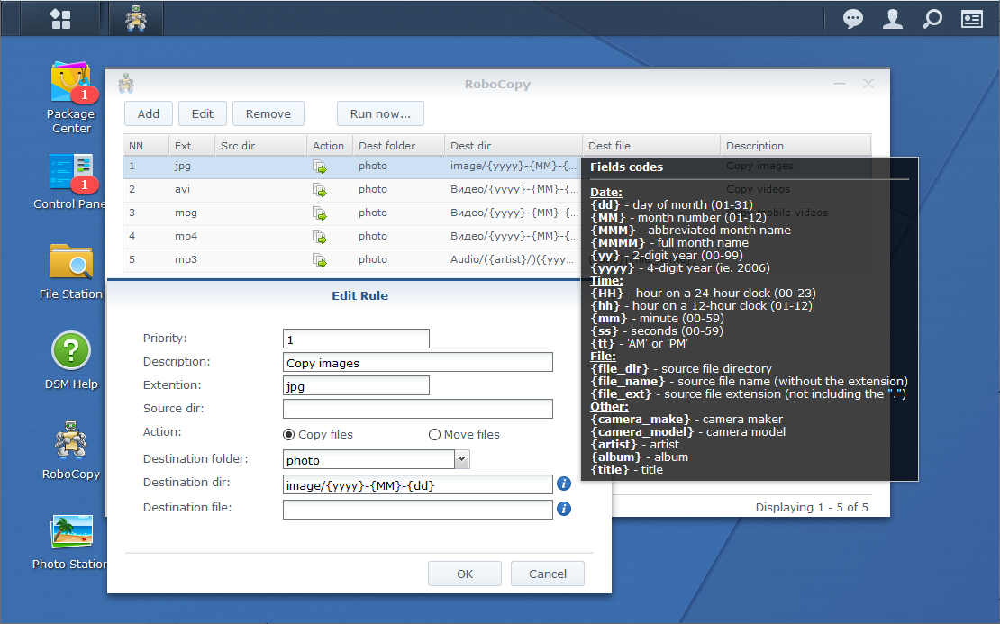

# RoboCopy
This package will help organize your collection of photos and videos into a custom folder structure using rules based on EXIF information.




## How to install

**Step 1:** Install standard PERL package

**Step 2:** Download the latest `.spk` from [here](https://github.com/vitaly-s/robocopy/releases/latest)

**Step 3:** Open Package Center in DSM and select the `Manual Install` option.

**Step 4:** Click `Yes` when warned about using a package from an unknown publisher.

**Step 5:** Complete the wizard.

**Step 6:** Use the RoboCopy app icon in the main menu to access the RoboCopy UI where you can manage your setup.

## Rules

Rules specify what actions need to be performed on files.

|Rule field| Meaning |
| --- | --- |
| Priority | Rule execution order. |
| Description | Rule description. |
| Extention | File extension for applying this rule. |
| Action | How to process a file: move or copy. |
| Destination folder | Shared destination folder. |
| Destination dir | Destination path. (*Here you can use [value substitution](#values-for-substitution)*) |
| Destination file | The name of the destination file. If empty, the file name will not change. (*Here you can use [value substitution](#values-for-substitution)*) |


### Values for substitution
Values for substitution based on file metadata, they must be indicated by the mustaches (Ex. **{title}**). Value name is ***case sensitive***.

The [Phil Harvey's ExifTool library](http://www.sno.phy.queensu.ca/~phil/exiftool/) is used to obtain file metadata.

<table>
    <tr><th>Name</th><th>Meaning</th><th>Example</th></tr>
    <tr><td colspan="3"><i>Date time file creation</i></td></tr>
    <tr><td>h</td><td>Hour (12-hour clock) as a decimal number.</td><td>7</td></tr>
    <tr><td>hh</td><td>Hour (12-hour clock) as a zero-padded decimal number.</td><td>07</td></tr>
    <tr><td>H</td><td>Hour (24-hour clock) as a decimal number</td><td>7</td></tr>
    <tr><td>HH</td><td>Hour (24-hour clock) as a zero-padded decimal number.</td><td>07</td></tr>
    <tr><td>m</td><td>Minute as a decimal number.</td><td>6</td></tr>
    <tr><td>mm</td><td>Minute as a zero-padded decimal number.</td><td>06</td></tr>
    <tr><td>s</td><td>Second as a decimal number.</td><td>5</td></tr>
    <tr><td>ss</td><td>Second as a zero-padded decimal number.</td><td>05</td></tr>
    <tr><td>tt</td><td>Locale's equivalent of either AM or PM</td><td>AM</td></tr>
    <tr><td>d</td><td>Day of the month as a decimal number.</td><td>2</td></tr>
    <tr><td>dd</td><td>Day of the month as a zero-padded decimal number.</td><td>02</td></tr>
    <tr><td>ddd</td><td>Weekday as locale's abbreviated name.</td><td>Mon</td></tr>
    <tr><td>dddd</td><td>Weekday as locale's full name.</td><td>Monday</td></tr>
    <tr><td>M</td><td>Month as a decimal number.</td><td>9</td></tr>
    <tr><td>MM</td><td>Month as a zero-padded decimal number.</td><td>09</td></tr>
    <tr><td>MMM</td><td>Month as locale's abbreviated name.</td><td>Sep</td></tr>
    <tr><td>MMMM</td><td>Month as locale's full name.</td><td>September</td></tr>
    <tr><td>y</td><td>Year without century as a decimal number.</td><td>1</td></tr>
    <tr><td>yy</td><td>Year without century as a zero-padded decimal number.</td><td>01</td></tr>
    <tr><td>yyyy</td><td>Year with century as a decimal number.</td><td>2001</td></tr>
    <tr><td colspan="3"><i>File name</i></td></tr>
    <tr><td>file_ext</td><td>File extension</td><td></td></tr>
    <tr><td>file_dir</td><td>Path to file (without start dir)</td><td></td></tr>
    <tr><td>file_name</td><td>File name</td><td></td></tr>
    <tr><td colspan="3"><i>Location</i></td></tr>
    <tr><td>country</td><td>Country name where was made photo</td><td>United States of America</td></tr>
    <tr><td>state</td><td>State name where was made photo</td><td>Massachusetts</td></tr>
    <tr><td>city</td><td>City name where was made photo</td><td>Quincy</td></tr>
    <tr><td colspan="3"><i>Other</i></td></tr>
    <tr><td>title</td><td>Title of composition</td><td></td></tr>
    <tr><td>album</td><td>Album name</td><td></td></tr>
    <tr><td>artist</td><td>Artist name</td><td></td></tr>
    <tr><td>camera_make</td><td>Camera maker name</td><td></td></tr>
    <tr><td>camera_model</td><td>Camera name</td><td></td></tr>
</table>

### Using fallback folders

There are times when the EXIF needed to correctly name a folder doesn't exist on a photo. I made fallback folders (thanks [Elodie](https://github.com/jmathai/elodie) for idea) to help you deal with situations such as this. Here's how it works.

You can specify a series of folder names by taking them in parentheses and separating them with '|'. That's a pipe, not an 'L'. Let's look at an example.

```
/{yyyy}/({album}-{title}|{city}|Other)
```

What this asks me to do is to name the last folder the same as the "album"-"title" I find in EXIF. If I don't find an album or title in EXIF then I should use the city. If there's no GPS in the EXIf or I cannot detect it then I should name the last folder "Other".


## Location detection

I use [Nominatim](https://nominatim.org/) to help me organize your photos by location. 

Geolocation information is not cached between sessions.
But for query optimization I use the following algorithm:
1. I check that the point belongs to any city that I requested earlier (CITY_CACHE). If successful, I return the address of the city.
2. I check that the point is near (less than the threshold) with the points that I requested earlier (POINT_CACHE). If successful, I return the address of the point.
3. I request data from the server.
4. I try to get a polygon that sets the boundaries of the city. If successful, then I remember it in CITY_CACHE.
5. If step 4 is failed, then I remember the point in POINT_CACHE.

Language of returned information and threshold value You can change in settings.


## Notes

### Requirements

* DSM 4.2 and above
* PERL


### Tested on
- software: DSM 4.2, DSM 4.3, DSM 6.1, DSM 6.2
- hardware: DS209, DS218+


## Build

Require linux machine with Perl (I use my NAS).

Download sources and exec make.sh 
```
$ sh ./make.sh
```
